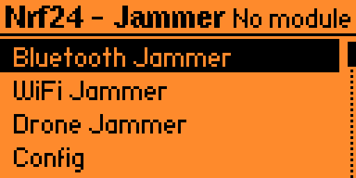
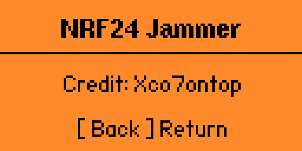

# Nrf24 Jammer Plus

> ⚠️ **Disclaimer:** This project is intended for authorized testing and experimentation with your own hardware and RF environment. Do not use RF transmission features to interfere with networks, devices, or communications that you do not own or have permission to test.

## ⚙️ Firmware Support

This application is built specifically for **Flipper Zero with Momentum Firmware**.

> **Momentum Firmware is required.**


## Preview



## Features

* Custom Flipper Zero interface
* NRF24 module detection
* Support for multiple NRF24 modules
* Configurable SPI mode
* Together / Separate module modes

## Configuration

The app currently provides three configuration options:

### SPI Pin

* `Default (4)`
* `Extra (7)`

### Modules

* `Together`
* `Separate`

### Sound

* `OFF`
* `ON`

Settings are saved automatically and restored when the application starts.

## Project Structure

```text
.
├── application.fam
├── main.c
├── icon.png
└── lib/
    └── nrf24_lib/
        ├── nrf24.c
        └── nrf24.h

```

## Building

This project uses the **Flipper Build Tool (UFBT)**.

Open a terminal in the project directory:

```bash
ufbt build
```

## Launch

To build and launch the application directly on a connected Flipper Zero:

```bash
ufbt launch
```

Make sure your Flipper Zero is connected to your computer and detected by UFBT.

You can also build the application first and manually install the generated .fap file using qFlipper or the Flipper mobile app.
## Interface

The main menu contains:

```text
Nrf24 - Jammer
├── Bluetooth Jammer
├── WiFi Jammer
├── Drone Jammer
├── Config
└── About
```

The application also displays the detected NRF24 module count and provides visual/audio feedback for application actions.

## Settings Storage

Configuration is stored on the Flipper SD card at:

```text
/ext/apps_data/fz_nrf24_jammer/settings.txt
```

The stored values include:

```text
spi=
modules=
sound=
```

## Version

**v1.0.0**

## Credits



**Web:** xco7.com.tr
